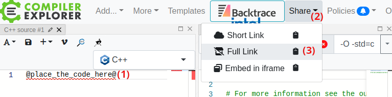

# godbolt_link

[](https://github.com/YarikTH/godbolt_link/releases)

Command-line tool and library to generate [Compiler Explorer](https://godbolt.org/) links.

## How to use 

This tool uses template based approach. To use it, you need to make a template URL first:

<p align="left"></p>

1. Place @place_the_code_here@ text in source window, it would be replaced with given code
2. Open `Share` menu
3. Click `Full Link`
4. Copy given link

Then pass it to the tool with path to wanted source file.

Example:

https://godbolt.org/#g:!((g:!((g:!((h:codeEditor,i:(filename:%271%27,fontScale:14,fontUsePx:%270%27,j:1,lang:c%2B%2B,selection:(endColumn:22,endLineNumber:1,positionColumn:22,positionLineNumber:1,selectionStartColumn:22,selectionStartLineNumber:1,startColumn:22,startLineNumber:1),source:%27@place_the_code_here@%27),l:%275%27,n:%270%27,o:%27C%2B%2B+source+%231%27,t:%270%27)),k:50,l:%274%27,n:%270%27,o:%27%27,s:0,t:%270%27),(g:!((g:!((h:compiler,i:(compiler:g122,deviceViewOpen:%271%27,filters:(b:%270%27,binary:%271%27,commentOnly:%270%27,demangle:%270%27,directives:%270%27,execute:%270%27,intel:%270%27,libraryCode:%271%27,trim:%271%27),flagsViewOpen:%271%27,fontScale:14,fontUsePx:%270%27,j:1,lang:c%2B%2B,libs:!(),options:%27-O+-std%3Dc%2B%2B17%27,selection:(endColumn:1,endLineNumber:1,positionColumn:1,positionLineNumber:1,selectionStartColumn:1,selectionStartLineNumber:1,startColumn:1,startLineNumber:1),source:1),l:%275%27,n:%270%27,o:%27+x86-64+gcc+12.2+(Editor+%231)%27,t:%270%27)),k:50,l:%274%27,m:50,n:%270%27,o:%27%27,s:0,t:%270%27),(g:!((h:output,i:(editorid:1,fontScale:14,fontUsePx:%270%27,j:1,wrap:%271%27),l:%275%27,n:%270%27,o:%27Output+of+x86-64+gcc+12.2+(Compiler+%231)%27,t:%270%27)),header:(),l:%274%27,m:50,n:%270%27,o:%27%27,s:0,t:%270%27)),k:50,l:%273%27,n:%270%27,o:%27%27,t:%270%27)),l:%272%27,n:%270%27,o:%27%27,t:%270%27)),version:4

and

```c++
#include <iostream>

int main()
{
    std::cout << "Hello world!" << '\n';
}
```

gives

https://godbolt.org/#z:OYLghAFBqd5QCxAYwPYBMCmBRdBLAF1QCcAaPECAMzwBtMA7AQwFtMQByARg9KtQYEAysib0QXACx8BBAKoBnTAAUAHpwAMvAFYTStJg1DIApACYAQuYukl9ZATwDKjdAGFUtAK4sGIM2akrgAyeAyYAHI%2BAEaYxHoADqgKhE4MHt6%2B/oFJKY4CoeFRLLHxXLaY9vkMQgRMxAQZPn4BFVVptfUEhZExcXoKdQ1NWa2DXT3FpRIAlLaoXsTI7BzmAMxhyN5YANQma25Og8SYrPvYJhoAgpdXYQQ7LExhEDO3JgDsVtc7vzuD6BAKAWD32bjBewCAAlKrRUDsAO4kWjoMBgcxmPYHCFgVYAVjcDFx%2B2%2BNw%2BABEOHNaJw8bw/BwtKRUJxwZZrP8FktMJC1jxSARNFS5gBrEB4jT6TiSelC5mcXgKECSwWMqmkOCwGCIYEsBJ0OLkShoPUG%2BLALitLAANzwywAanhMAiAPIJRicfk0WgEOJKiDROXRML1ACent4JrYghdDFo4bVpCwTyM4kT%2BBODjw1swSsTmFUmGQXl9cvulTltDw0WIYY8WAjAuIeBYEbmVAMwAUjudbo93F4/EEIjE7CkMkEihU6kTunKBiMKGs1n01aVkDmqAS1TzAFoXTtdwD9uTTOzLFwPorKkXqi4GO5PM09CEwr0Sv1yrlUgIRn4v8kP4MJMfRlG0t4dEMjRPlk5R2BBAidA0IEfmB4zDDB/62FBKHTFwcwKFyyyzFKHB0qQDJMiyHA7KoAAcABsu4MZIOzAMgyA7JaAB0mIQLghAkLy%2BG8KqWgzKK4qSjSHAyqQrYShRcrUYqyoCkKcyajqIIJCWRoQJg%2BBEM2gLlEOwiiOI47mVOahynOpAIrWCRtqR5GUbw1EuiWukPKgVC0YxzGsexnE8XxHimvQxDCTMokaXMCCnFg8SvKRckKZKHnyhwqkqglpBiopMlrLKiYqepaoSaRZhlVRCqVeJcw5sQKTOJIQA%3D%3D%3D

## Cons

Unfortunately full links contain 1500-2000 characters even in trivial cases.
So it might be better to use official [RESTful API](https://github.com/compiler-explorer/compiler-explorer/blob/main/docs/API.md)
to request creation of the short link for given code. For python this API can be used via [cexpl](https://github.com/xfgusta/cexpl) package.

## License
Copyright (c) 2023 Yaroslav Krylov. Distributed under the MIT license.
